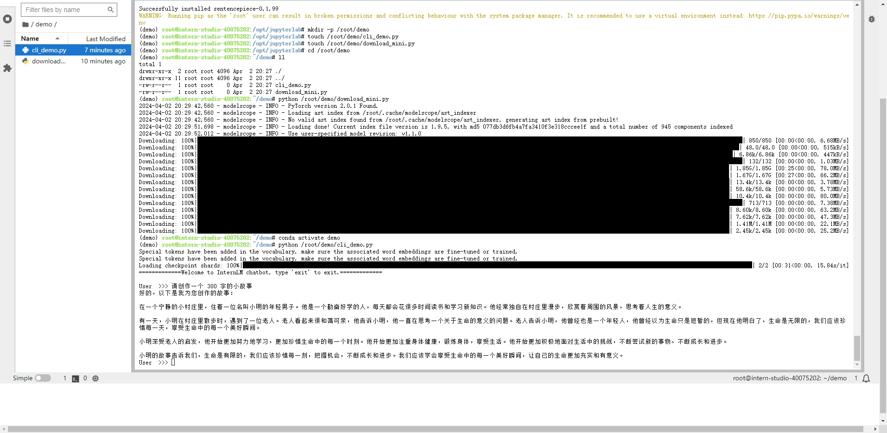
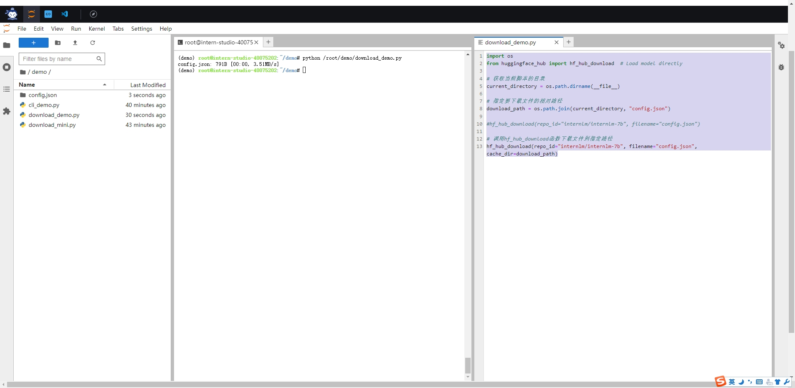
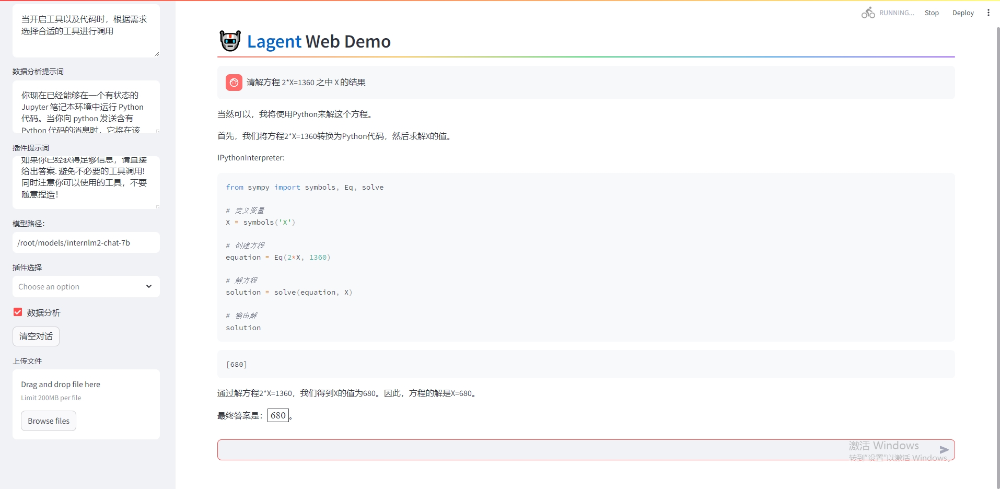
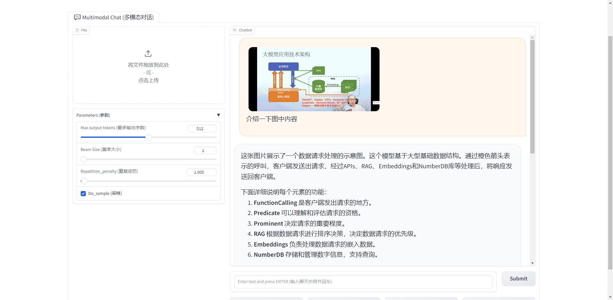

# 书生浦语大模型实战营二期 · 课程作业_02


## 相关资料链接

> 课程视频：https://www.bilibili.com/video/BV1Ci4y1z72H/
>
> 文档链接：https://github.com/InternLM/Tutorial/blob/camp2/helloworld/hello_world.md


## 使用`InternLM2-Chat-1.8B`模型生成300字的小故事

增加cli_demo.py注释，便于新手理解 

```python
import torch  # 导入PyTorch库
from transformers import AutoTokenizer, AutoModelForCausalLM  # 从transformers库中导入AutoTokenizer和AutoModelForCausalLM类

# 指定预训练模型的路径
model_name_or_path = "/root/models/Shanghai_AI_Laboratory/internlm2-chat-1_8b"

# 加载预训练模型的tokenizer，设备映射到cuda:0上
tokenizer = AutoTokenizer.from_pretrained(model_name_or_path, trust_remote_code=True, device_map='cuda:0')
# 加载预训练的CausalLM模型，信任远程代码，指定torch数据类型为bfloat16，设备映射到cuda:0上
model = AutoModelForCausalLM.from_pretrained(model_name_or_path, trust_remote_code=True, torch_dtype=torch.bfloat16, device_map='cuda:0')
model = model.eval()  # 设置模型为评估模式

# 系统提示文字，介绍了AI助手的一些信息
system_prompt = """You are an AI assistant whose name is InternLM (书生·浦语).
- InternLM (书生·浦语) is a conversational language model that is developed by Shanghai AI Laboratory (上海人工智能实验室). It is designed to be helpful, honest, and harmless.
- InternLM (书生·浦语) can understand and communicate fluently in the language chosen by the user such as English and 中文.
"""

# 将系统提示信息存储在元组中
messages = [(system_prompt, '')]

print("=============Welcome to InternLM chatbot, type 'exit' to exit.=============")

# 进入对话交互循环
while True:
    input_text = input("\nUser  >>> ")  # 用户输入文本
    input_text = input_text.replace(' ', '')  # 移除输入文本中的空格
    if input_text == "exit":  # 如果用户输入exit，则结束对话
        break

    length = 0  # 初始化文本长度为0
    for response, _ in model.stream_chat(tokenizer, input_text, messages):  # 调用stream_chat方法开始对话生成
        if response is not None:  # 如果生成的回复不为空
            print(response[length:], flush=True, end="")  # 输出生成的回复
            length = len(response)  # 更新文本长度
```


​	主要演示部署本地智能对话模型：




## 下载熟悉的`huggingface`功能

  download_demo.py 代码

```
import os 
from huggingface_hub import hf_hub_download  # Load model directly 

# 获取当前脚本的目录
current_directory = os.path.dirname(__file__)

# 指定要下载文件的相对路径
download_path = os.path.join(current_directory, "config.json")

#hf_hub_download(repo_id="internlm/internlm-7b", filename="config.json")

# 调用hf_hub_download函数下载文件到指定路径
hf_hub_download(repo_id="internlm/internlm-7b", filename="config.json", cache_dir=download_path)
```




## 浦语·灵笔


​		lagent演示：




#### 图文创作

```reStructuredText
根据以下标题：“武侠江湖：是男人刻在骨子里的浪漫”，创作长文章，字数不少于800字。请结合以下文本素材：
“武侠小说是中国传统文学中独具风采的一种体裁，描绘了侠客豪情、刀光剑影、正邪较量的精彩世界。情节曲折离奇，人物性格鲜明，武功高强，角色间情仇恩怨交织，展现了侠义情怀和荡气回肠的江湖风貌。主角多为仗剑行侠、义薄云天的英雄人物，对抗着各种邪恶势力，忠于信念，坚守侠义准则。在武侠世界中，正邪之间、友情爱情交织，展现出中国传统文化中的侠骨柔情和仗剑江湖的独特魅力与长久韵味。”
```


#### 图片理解

```text
上传一张大模型架构图

灵笔识别：

这张图片展示了一个数据请求处理的示意图。这个模型基于大型基础数据结构。通过橙色箭头表示的呼叫，客户端发送出请求，经过APIs、RAG、Embeddings和NumberDB库等处理后，将响应发送回客户端。

下面详细说明每个元素的功能：

FunctionCalling 是客户端发出请求的地方。
Predicate 可以理解和评估请求的资格。
Prominent 决定请求的重要程度。
RAG 根据数据请求进行排序决策，决定数据请求的优先级。
Embeddings 负责处理数据请求的嵌入数据。
NumberDB 存储和管理数字信息，支持查询。
```



