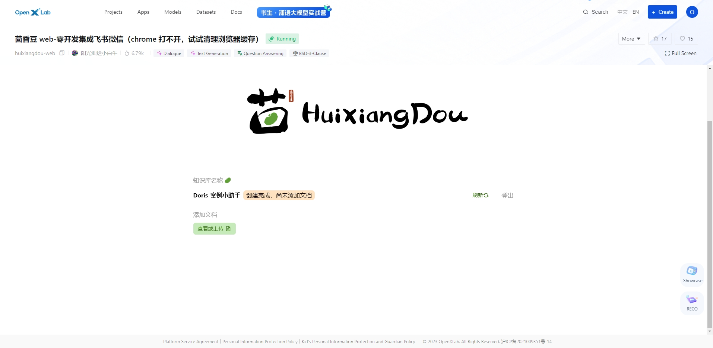

# 书生浦语大模型实战营二期 · 课程作业_03


## 相关资料链接

> 课程视频：https://www.bilibili.com/video/BV1QA4m1F7t4/?spm_id_from=pageDriver&vd_source=a7bc450dd950f3c322e48e42ee9e8db4
>
> 文档链接：https://github.com/InternLM/Tutorial/blob/camp2/huixiangdou/readme.md
>
> 茴香豆文档：https://github.com/InternLM/HuixiangDou


## 基础作业

###  在[茴香豆 Web 版](https://openxlab.org.cn/apps/detail/tpoisonooo/huixiangdou-web)中创建自己领域的知识问答助手


#### **登录茴香豆web**




#### 页面上传本地文件 **Apache Doris 用户案例集**

上传过程有个小插曲，页面优化建议：

- 现象：web端上传单个文件最大限制为35M，

  建议：提前提示，而非上传后才告知，方便用户提前准备文件。比如我这次上传的PDF为52M，必须拆分文件。

- 现象：在添加页面中，提示文件限制警告后，不关闭添加页面，重新选择原来的文件，页面无响应；换个文件或关闭添加页面重新打开，再次选择相同文件，页面正常响应。

  建议：报错提示后，对相同文件保持正常处理，避免给用户一种无响应的错觉体验。

- 现象：上传多个文件时，部分文件失败，无法查看错误原因以及删除错误文件

  建议：提供针对上传容错操作。


#### **切分文件满足大小后再次上传**


> PS:文件有read error,暂时还没头绪如何定位，初步猜测是否能文件切分有关？


#### **开始对话**


先简单尝试了两个问题，第一个问题可能由于之前切分文件上传后，无法获取完整信息导致回答显得”不专业“；

第二个问题反馈来看就是完全没有检索到，或许是我提问不对，换个问法再试试


```tex
Q:如何打破数据孤岛？

A:很抱歉，您提供的参考材料并未直接回答您的问题。但是，我可以为您提供一些关于如何打破数据孤岛的建议。

打破数据孤岛通常涉及以下几个步骤：

1. **明确目标和需求**：
   - 确定打破数据孤岛的目标，例如提高数据共享、促进数据分析和决策制定等。
   - 了解当前数据孤岛的情况，包括数据存储在哪些系统中、数据格式、质量等。

2. **建立数据集成平台**：
   - 选择一个或多个数据集成平台（如Apache Doris）来整合不同来源的数据。
   - 确保数据集成平台具有良好的可扩展性、性能和安全特性。

3. **设计数据集成架构**：
   - 设计一个清晰的架构来管理数据流动，包括数据提取、转换和加载（ETL）过程。
   - 考虑使用数据仓库或数据湖来存储和管理数据。

4. **实施数据治理**：
   - 建立数据治理框架，确保数据质量、安全性和合规性。
   - 定义数据所有权、访问权限和数据生命周期管理策略。

5. **推动文化变革**：
   - 通过培训和意识提升活动，鼓励员工采用新的数据共享和使用方式。
   - 建立跨部门协作的机制，促进团队之间的合作和知识共享。

6. **持续监控和优化**：
   - 定期评估数据集成平台的性能和效果，及时进行调整和优化。
   - 根据业务需求和技术进步，更新数据集成架构和工具。

对于具体的问题，建议您向Apache Doris社区的技术交流群寻求专业的解答。他们可能会提供针对Apache Doris的特定建议和指导。

希望这些建议能对您有所帮助。如果您有其他问题或需要进一步的帮助，请随时告诉我。
参考文档: 
页面 241.pdf
Apache Doris 用户案例集126.pdf


```


可以看到还是命中了文档，只是文档中无法完全回答我的问题，所以这里豆哥也借助自己本身大模型的能力结合外部知识库综合回答用户问题，非常不错的能力。


#### 添加正向、反向用例


```
Q:ClickHouse 对比Doris性能如何？
A:很抱歉，在您提供的参考材料中，并没有关于ClickHouse和Doris性能对比的相关信息。如果您有其他问题或者需要了解Apache Doris的更多信息，我很乐意为您提供帮助。如果您对性能对比感兴趣，建议您查阅官方文档、技术论坛或者相关比较评测报告来获取更准确的信息。
[Empty]: Irrelevant answer.
```


#### **既然这样，取消反向用例后看看**


> PS: 更新正反例后，需要刷新才能生效。

取消后，再次询问相同问题，观察回答

```
Q:ClickHouse 对比Doris性能如何？
A:很抱歉，您提供的材料中并没有关于 ClickHouse 对比 Doris 性能的信息。因此，我无法根据您提供的材料回答这个问题。如果您有其他关于 ClickHouse 或 Doris 的问题，我将尽力为您提供帮助。

不过，我可以告诉您，Apache Doris 和 ClickHouse 都是优秀的开源大数据处理系统，它们都专注于处理大规模数据的实时查询和分析。以下是一些比较它们性能的常见因素：

1. **查询性能**：ClickHouse 以其优化的列存储和高效的查询执行引擎而闻名，通常能够提供更快的查询响应时间。而 Doris 也拥有强大的查询性能，特别是当它运行在分布式集群时。

2. **可扩展性**：Doris 支持分布式部署，能够轻松地扩展到数千个节点，适合处理 TB 到 PB 级别的数据。ClickHouse 也支持分布式架构，并具有良好的可扩展性。

3. **数据加载**：ClickHouse 在数据加载方面表现优异，支持多种数据源和加载方式。Doris 也提供了多种数据导入和同步工具，并支持流式数据处理。

4. **生态系统**：ClickHouse 拥有一个庞大的开发者社区，拥有丰富的插件和工具，使得它在生态系统方面具有一定的优势。Doris 也在不断壮大其生态系统，提供越来越多的组件和工具。

5. **易用性和开发效率**：ClickHouse 提供了 SQL 接口，使得用户可以方便地进行数据查询和分析。Doris 也支持 SQL，并提供了丰富的客户端工具和开发工具，便于用户使用和开发。

综上所述，ClickHouse 和 Doris 在性能上各有优势，具体取决于您的需求和使用场景。为了获得更准确的对比，建议您查阅相关的性能测试报告或亲自进行测试。
参考文档: 
页面 241.pdf
页面 171.pdf
Apache Doris 用户案例集126.pdf
```


由此可见，取消反例设置后，豆哥还是采取先检索本地知识库，无法根据本地知识库做出回答，且问题符合应答条件，则会根据自身大模型生成回答，符合预期期望。


### 在 `InternLM Studio` 上部署茴香豆技术助手

安装基础基础环境，命名为 `InternLM2_Huixiangdou`：

```shell
studio-conda -o internlm-base -t InternLM2_Huixiangdou
```


激活 `InternLM2_Huixiangdou` 环境:

```shell
conda activate InternLM2_Huixiangdou
```


安装完成后如图：


后续代码都运行在`InternLM2_Huixiangdou` 环境中，所以先激活环境：

```shell
conda activate InternLM2_Huixiangdou
```


#### 下载安装茴香豆以及所需依赖

```shell
# 安装 python 依赖
# pip install -r requirements.txt

pip install protobuf==4.25.3 accelerate==0.28.0 aiohttp==3.9.3 auto-gptq==0.7.1 bcembedding==0.1.3 beautifulsoup4==4.8.2 einops==0.7.0 faiss-gpu==1.7.2 langchain==0.1.14 loguru==0.7.2 lxml_html_clean==0.1.0 openai==1.16.1 openpyxl==3.1.2 pandas==2.2.1 pydantic==2.6.4 pymupdf==1.24.1 python-docx==1.1.0 pytoml==0.1.21 readability-lxml==0.8.1 redis==5.0.3 requests==2.31.0 scikit-learn==1.4.1.post1 sentence_transformers==2.2.2 textract==1.6.5 tiktoken==0.6.0 transformers==4.39.3 transformers_stream_generator==0.0.5 unstructured==0.11.2

## 因为 Intern Studio 不支持对系统文件的永久修改，在 Intern Studio 安装部署的同学不建议安装 Word 依赖，后续的操作和作业不会涉及 Word 解析。
## 想要自己尝试解析 Word 文件的同学，uncomment 掉下面这行，安装解析 .doc .docx 必需的依赖
# apt update && apt -y install python-dev python libxml2-dev libxslt1-dev antiword unrtf poppler-utils pstotext tesseract-ocr flac ffmpeg lame libmad0 libsox-fmt-mp3 sox libjpeg-dev swig libpulse-dev

```


注意：Word文档需要单独下载，以后有使用到再来下载。


#### 修改配置文件，选用课程相关模型

```shell
sed -i '6s#.*#embedding_model_path = "/root/models/bce-embedding-base_v1"#' /root/huixiangdou/config.ini
sed -i '7s#.*#reranker_model_path = "/root/models/bce-reranker-base_v1"#' /root/huixiangdou/config.ini
sed -i '29s#.*#local_llm_path = "/root/models/internlm2-chat-7b"#' /root/huixiangdou/config.ini
```

这里仅修改了词嵌入的模型和重排序模型，生成模型的参数设置，其他参数设置作用可以在笔记中去查询了解。


#### **sed 命令作用**

以第一个命令为例：

- 用途：编辑指定配置文件
- 目标文件：`/root/huixiangdou/config.ini`
- 目标行号：第 6 行
- 替换内容：将以 `embedding_model_path = ` 开头的内容替换为新路径 `"/root/models/bce-embedding-base1"`

> 应该是老师考虑同学直接操作`.ini`文件可能引起错误配置，采取这种方式避免误操作，从而导致运行错误。


#### 创建 RAG 检索过程中使用的向量数据库：

```shell
# 创建向量数据库存储目录
cd /root/huixiangdou && mkdir workdir 

# 分别向量化知识语料、接受问题和拒绝问题中后保存到 workdir
python3 -m huixiangdou.service.feature_store --sample ./test_queries.json

```


显示向量化成功，并且测试一个正向问题和反向问题，接下来，运行起来看看实际效果


#### **运行茴香豆知识助手**：

```shell
# 填入问题
sed -i '74s/.*/    queries = ["huixiangdou 是什么？", "茴香豆怎么部署到微信群", "今天天气怎么样？"]/' /root/huixiangdou/huixiangdou/main.py

# 运行茴香豆
cd /root/huixiangdou/
python3 -m huixiangdou.main --standalone

```

基于前面的资料，我们已经知道 第一个sed 命令是将特定文件中内容替换，这个是替换了问题，我们可以看看

`/root/huixiangdou/huixiangdou/main.py` 74行，本意也就是替换你的问题，然后运行。后续也可以在文件中直接编辑。

```python
#!/usr/bin/env python3
# Copyright (c) OpenMMLab. All rights reserved.
"""HuixiangDou binary."""
import argparse
import os
import time
from multiprocessing import Process, Value

import pytoml
import requests
from aiohttp import web
from loguru import logger

from .service import ErrorCode, Worker, llm_serve


def parse_args():
    """Parse args."""
    parser = argparse.ArgumentParser(description='Worker.')
    parser.add_argument('--work_dir',
                        type=str,
                        default='workdir',
                        help='Working directory.')
    parser.add_argument(
        '--config_path',
        default='config.ini',
        type=str,
        help='Worker configuration path. Default value is config.ini')
    parser.add_argument('--standalone',
                        action='store_true',
                        default=False,
                        help='Auto deploy required Hybrid LLM Service.')
    args = parser.parse_args()
    return args


def check_env(args):
    """Check or create config.ini and logs dir."""
    if not os.path.exists('logs'):
        os.makedirs('logs')
    CONFIG_NAME = 'config.ini'
    CONFIG_URL = 'https://raw.githubusercontent.com/InternLM/HuixiangDou/main/config.ini'  # noqa E501
    if not os.path.exists(CONFIG_NAME):
        logger.warning(
            f'{CONFIG_NAME} not found, download a template from {CONFIG_URL}.')

        try:
            response = requests.get(CONFIG_URL, timeout=60)
            response.raise_for_status()
            with open(CONFIG_NAME, 'wb') as f:
                f.write(response.content)
        except Exception as e:
            logger.error(f'Failed to download file due to {e}')
            raise e

    if not os.path.exists(args.work_dir):
        logger.warning(
            f'args.work_dir dir not exist, auto create {args.work_dir}.')
        os.makedirs(args.work_dir)


def build_reply_text(reply: str, references: list):
    if len(references) < 1:
        return reply

    ret = reply
    for ref in references:
        ret += '\n'
        ret += ref
    return ret


def lark_send_only(assistant, fe_config: dict):
    queries = ['请问如何安装 mmpose ?']
    for query in queries:
        code, reply, references = assistant.generate(query=query,
                                                     history=[],
                                                     groupname='')
        logger.info(f'{code}, {query}, {reply}, {references}')
        reply_text = build_reply_text(reply=reply, references=references)

        if fe_config['type'] == 'lark' and code == ErrorCode.SUCCESS:
            # send message to lark group
            from .frontend import Lark
            lark = Lark(webhook=fe_config['webhook_url'])
            logger.info(f'send {reply} and {references} to lark group.')
            lark.send_text(msg=reply_text)


def lark_group_recv_and_send(assistant, fe_config: dict):
    from .frontend import (is_revert_command, revert_from_lark_group,
                           send_to_lark_group)
    msg_url = fe_config['webhook_url']
    lark_group_config = fe_config['lark_group']
    sent_msg_ids = []

    while True:
        # fetch a user message
        resp = requests.post(msg_url, timeout=10)
        resp.raise_for_status()
        json_obj = resp.json()
        if len(json_obj) < 1:
            # no user input, sleep
            time.sleep(2)
            continue

        logger.debug(json_obj)
        query = json_obj['content']

        if is_revert_command(query):
            for msg_id in sent_msg_ids:
                error = revert_from_lark_group(msg_id,
                                               lark_group_config['app_id'],
                                               lark_group_config['app_secret'])
                if error is not None:
                    logger.error(
                        f'revert msg_id {msg_id} fail, reason {error}')
                else:
                    logger.debug(f'revert msg_id {msg_id}')
                time.sleep(0.5)
            sent_msg_ids = []
            continue

        code, reply, references = assistant.generate(query=query,
                                                     history=[],
                                                     groupname='')
        if code == ErrorCode.SUCCESS:
            json_obj['reply'] = build_reply_text(reply=reply,
                                                 references=references)
            error, msg_id = send_to_lark_group(
                json_obj=json_obj,
                app_id=lark_group_config['app_id'],
                app_secret=lark_group_config['app_secret'])
            if error is not None:
                raise error
            sent_msg_ids.append(msg_id)
        else:
            logger.debug(f'{code} for the query {query}')


def wechat_personal_run(assistant, fe_config: dict):
    """Call assistant inference."""

    async def api(request):
        input_json = await request.json()
        logger.debug(input_json)

        query = input_json['query']

        if type(query) is dict:
            query = query['content']

        code, reply, references = assistant.generate(query=query,
                                                     history=[],
                                                     groupname='')
        reply_text = build_reply_text(reply=reply, references=references)

        return web.json_response({'code': int(code), 'reply': reply_text})

    bind_port = fe_config['wechat_personal']['bind_port']
    app = web.Application()
    app.add_routes([web.post('/api', api)])
    web.run_app(app, host='0.0.0.0', port=bind_port)


def run():
    """Automatically download config, start llm server and run examples."""
    args = parse_args()
    check_env(args)

    if args.standalone is True:
        # hybrid llm serve
        server_ready = Value('i', 0)
        server_process = Process(target=llm_serve,
                                 args=(args.config_path, server_ready))
        server_process.daemon = True
        server_process.start()
        while True:
            if server_ready.value == 0:
                logger.info('waiting for server to be ready..')
                time.sleep(3)
            elif server_ready.value == 1:
                break
            else:
                logger.error('start local LLM server failed, quit.')
                raise Exception('local LLM path')
        logger.info('Hybrid LLM Server start.')

    # query by worker
    with open(args.config_path, encoding='utf8') as f:
        fe_config = pytoml.load(f)['frontend']
    logger.info('Config loaded.')
    assistant = Worker(work_dir=args.work_dir, config_path=args.config_path)

    fe_type = fe_config['type']
    if fe_type == 'lark' or fe_type == 'none':
        lark_send_only(assistant, fe_config)
    elif fe_type == 'lark_group':
        lark_group_recv_and_send(assistant, fe_config)
    elif fe_type == 'wechat_personal':
        wechat_personal_run(assistant, fe_config)
    else:
        logger.info(
            f'unsupported fe_config.type {fe_type}, please read `config.ini` description.'  # noqa E501
        )

    # server_process.join()


if __name__ == '__main__':
    run()

```


运行后结果，如图：


#### 茴香豆怎么部署到微信群？


#### 尝试：

针对课程视频的问题，茴香豆很好的给出了答案，接下来，试试自己的想法，来点其他问题

```shell
# 填入问题
sed -i '74s/.*/    queries = ["茴香豆 是什么类型豆？", "茴香豆到底是谁在C啊？"]/' /root/huixiangdou/huixiangdou/main.py

# 运行茴香豆
cd /root/huixiangdou/
python3 -m huixiangdou.main --standalone
```


#### 总结：

从日志可以看到，提出的问题虽然通过主题疑问句的判断，但是询问主题内容与知识库内容匹配度不高，茴香豆没有像一般大模型一样乱编，产生幻觉，而是返回**不相关**，拒绝回答，这一点上是非常不错的。


```
good_questions_bk 不包括mmpose内容
```


