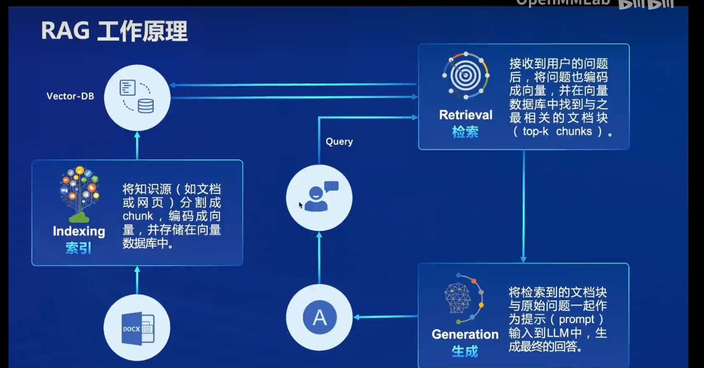

# 书生浦语大模型实战营二期 · 课程笔记_03


## 什么是RAG


​		首先，我们需要明白什么是RAG，课程中的简述如图：


> RAG通过检索器（Retriever）从预定义的知识库或文本数据中检索与问题相关的信息。检索器可以通过各种方式来实现，比如使用基于向量相似的搜索算法者使用专门设计的检索模型，A然后将检索到的信息传递给生成器（Generator），生成器使用这些作为上下，生成更准确、更丰富的回答或文本。生成器通常是一个预训练的生成式语言模型，比如GPT、InternLM等，最终实现结合检索到的信息来产生更加具有针对性的回答。


## 为什么需要RAG

尽管现有的大型语言模型（如GPT系列）在生成任务中表现出色，但它在处理检索问题时仍然存在一系列的挑战。主要包括以下几方面：

- 数据效率和稀疏性：我们知道大型语言模型通常需要大量的数据进行训练，但在面对**稀疏数据时表现较差**，比如在一些特定领域或专业知识的问题中，传统的大型语言模型可能无法进行准确的回答，产生幻觉，付出与收益不成正比。
- 搜索效率：面向检索的需求，许多应用场景中，用户需要关键词或问题查找特定信息。大型语言型在回答时需要处理大的上下文信息这会导致在**搜索过程中效率较低**。相比之下，RAG模型可以在检索阶段先从本地知识库中检索出相关信息，再结合问题一起交给生成器。

- 可解释性：RAG模型通过检索阶段的知识库，使得生成的答案可以更好地**解释其来源和逻辑**。相比之下，传统的生成模型可能难以解释其生成结果的原因，而RAG在这方面结合了检索和生成的优势，增强了模型的可解释性。
- 多模态支持：RAG模型不仅限于文本输入，还可以支持**多模态输入**，如图片、视频等。这使得RAG模型在处理多模态信息和模态搜索方面具有优势，适应了更多样化的应用场景
- 长期记忆和知识融合：RAG模型能够通过知识库中的信息来增强模型的**长期记忆和知融合能力**，从而使模型在问答场景中能够更好地先验证知识背景信息，最终生成更加准确的回答。


**总结**：尽管现的大型语模型在生成任务中表现优秀，但RAG模型的引入可以弥补其在检索任务中的不足处，**提高模型的效率和准确性**，拓展自然语言领域的应用范围。在问答系统、对话系统等自然语言处理任务中有着广泛的应用价值，但也不能代表RAG完全能取代所有大模型，RAG型与大型语言模型之间应该是一种**互补关系**，两者结合可以在自然语言任务中取得更好的效果。实际应用中，**根据具体需求和场景选择合适的模型**来达到最佳业务效果。


## 如何实现RAG

​		


谈到实现RAG，一般思路是从以下三方面入手：

| 阶段 | 实现方法                                                     | 例子 |
| ---- | ------------------------------------------------------------ | ---- |
| 索引 | 使用倒排索引技术构建知识库，进行数据预处理、构建索引结构、优化索引等。 |      |
| 检索 | 利用检索模型（如BM25、向量句子模型、向量空间模型等）从知识库检索相关文或片段，通过义匹配、档排序等技提高检索准确性。 |      |
| 生成 | 基于检索到的信息利用生成模型（如G系列）生成终的答案或回复，通过对话历史、上下文等信息连贯、多样的文本。通过以上三个骤的协同作，RAG模能够实现结检索与生成的任务，提高问答系统的果和性能。 |      |


## **常见行业做法**

| 行业 | 索引                                                         | 检索                                                         | 生成                                                         |
| ---- | ------------------------------------------------------------ | ------------------------------------------------------------ | ------------------------------------------------------------ |
| 电商 | 分析历史购买行为、浏览记录、搜索偏好等数据，识别用户购买意愿和偏好； | 建立商品推荐模型，结合用户画像和实时行为数据，个性化商品推荐，提高购转化率； | 实时监测用户行为，定期更新推荐结果，并通过短信、App推送、邮件等方式实时推送个性化推荐信息给用户，促进消费行为。 |
| 医疗 | 析患者的病历、症状和诊断结果数据，辅助医进行初步诊断和治疗决策； | 建立病情预测模型，结合患者的病史和实验室检测结果，预测病情发展趋势，指导医生调整治疗方案； | 提供个性化的治疗方案推荐，基于患者的病情特征和个人健康数据，实现精医疗，提治治疗效果。 |
| IT   | 处理技术文档和解决方案数据库，提取关键知识点和最佳实践方法； | 构建技术知识谱，实现技术文档的自动标注和分类，提供智化的知识检索服务； | 提供智能问答系统，通过服务实现自动回答技术问题，帮助开发人员快速获取解决方案和最佳实践。 |
| 金融 | 分析客户的财务数据、投资偏好和风险承受能力，定个性化财务规划； | 建立资产风险评估模型，结合市行情数据和投资组合特征为客户提个性化的投资建议； | 提供个性的财务规划方案和投资组合推荐，帮助客户实现理财目标，提高投资回报率。 |
| 旅游 | 分析用户历史旅游习惯、偏好和目的地选择记录，了解客的出行需求和喜好； | 构建旅游目的地推荐型模型，基于用户画像和目的地特征，为用户制定个性化的旅行推荐 | 提供个性化的旅游线路推荐和行程安排，包括景点推荐、交通路线、出行方式、天气预测等，为用户营造独一无二的旅行体验。 |
| 教育 | 分析学生的学习行为能力水平和学习偏好，定个性化的学习计划；   | 建立学习预测模型根据学生的历史学习数据和学科特点，生成个性化的学习路径，帮学生提高学效率； | 提供个性的学习资源推荐和周期性学习计划，包括教辅、习题等推荐，促进学生全面发展和成绩提升。 |


## 幻觉出现的原因

​		聊完RAG，回到刚开始，RAG出现的原因之一是大模型本身容易出现幻觉，那么为什么会出现幻觉？带着这个疑问，一起往下看，以下是一些常见的原因：

- 数据偏见：大型模型训练时所使用的数据可能**存在偏见**，导致模型在生成结果时出现不符合现实的幻觉。
- 迁移学习不当：大型模型在进行迁移学习时，可能没有很好地适应**新的环境或任务**，导致生成的结果出现偏差或幻觉。
- 训练数据不足：如果大型模型的训练**数据量不足或质量不佳**，可能导致模型在生成结果时出现幻觉。
- 网络结构问题：大型模型的**网络结构设计不合或参数设置不当**，也可能导致模型在生成结果时出现幻觉。
- 环境因素：在模型应用的具体环境中，可能存在一些**干扰因素或误导信息**，导致模型产生幻觉。


总的来说，大型模型产生幻觉的原因是多方面的，需要综合考虑**数据质量、模型设计、训过过程**等多个因素。


## 余弦函数是否是幻觉出现的原因之一

> **思考：向量数据库中常常根据余弦相似度来计算数据相似度，那么余弦计算的结果是否导致产生幻觉**


答案是："**不会"**

​		在向量数据库中使用余弦相似度计算数据之间的相似度是一种常见的做法，特别适用于计算文本、图像、音频类型数据的相似度。余弦相似度是一种度量两个向量方向的相似程度的指标，可以帮助我们衡量**向量之间的夹角，而不依赖于量的大小**。正常情况下，余相似度本上是一种数学计算方法，用于量化向量之间的相似度，计结果是客观的数值。在向量检索中，通常会设置一个相似度阈值，只有当两个向量的余弦相似度超过该阈值时，才认为它们是相似的，所以，**余弦相似度本身并不会导致产生幻觉**，但在实际使用时需要考虑到数据的特性和潜在隐患，可通过对**数据进行预处理**来确保计算结果准确性和可靠性。预处理包括以下几方面：

​	

| 操作       | 描述                                                         | 举例                                                         |
| ---------- | ------------------------------------------------------------ | ------------------------------------------------------------ |
| 数据清洗   | 处理数据中的错误、缺失或不一致部分，去除重复数据，处理缺失值等 | 去除数据集中的重复记录、处理缺失值、纠正数据中的错误值       |
| 数据缩放   | 将数据映射到合适的数值范围，保证不同特征的值处于相同尺度     | 将特征值缩放到相同的范围，可使用标准化（Standardization）或归一化（Normalization）的方法。 |
| 数据变换   | 通过数学变换或函数变换改变数据的方式，如对数变换、分数变换等 | 对数据进行对数变换使其更接近正态分布，或进行分位数变换将数据转换为新的分布 |
| 特征选择   | 选择最具预测性和信息量的特征，降低维度、减少计算复杂度，提高模型性能 | 使用信息增益或方差分析等方法选择最具代表性和预测性的特征，去除冗余特征 |
| 特征提取   | 从原始数据中抽取新的特征，如主成分分析（PCA）、独立成分分析（ICA）等 | 利用主成分分析（PCA）将原始特征转换为新的不相关特征，保留最重要的信息 |
| 数据集划分 | 将数据集划分为训练集和测试集，评估模型泛化能力，避免过拟合   | 将数据集按照一定比例划分为训练集和测试集，如70%用于训练，30%用于测试 |
| 数据标准化 | 将数据按一定标准进行处理，使其符合某种统计学规律             | 将数值特征进行标准化处理，使其均值为0，方差为1               |
| 数据降维   | 通过保持数据主要特征，减少维度，降低数据复杂度，提高训练效率 | 通过主成分分（PCA）将维数据映射到维空间，留最重要特征        |


**总结：**数据预处理阶段的质量会直接影响到最终模型的**准确性和可靠性**，因此在大模型的数据挖掘过程中，**充分、准确的数据**预处理是至关重要的一环。


## 如何优化RAG

基于课程提到**索引、检索、生成**三个方面以及前文提到的**数据预处理**入手：

索引优化：

- 数据结构选择：在构建问题到答案的索引时，可以选择使用倒排索引。例如，将每个问题分词后构建倒排索引，将包含相同关键词的问题归类在一起，以提高匹配效率。

- 特征工程优化：对于特征工程优化，可以使用词嵌入技术如`BERT`。通过将问题和答案分别输入BERT模型中，获取其对应的向量表示，来优化特征工程，提高语义匹配的准确性。

- 向量化技术提升：使用基于注意力机制的`Transformer`模型进行文本向量化。通过`Transformer`模型提取的文本向量，可以更准确地捕捉语义信息，从而提高匹配精度。

  

检索优化：

- 查询扩展技术：通过词嵌入技术，可以实现查询扩展。例如，将用户输入的查询关键词转换为词向量，然后在词向量空间中寻找相似词，扩展查询范围，提高匹配准确性。

- 多模态匹配：将文本和图像数据结合起来进行匹配。例如，对于问题和答案中包含图片信息的情况，可以将文本信息与图像特征进行融合，以提高匹配的准确性和全面性。

- 近似最近邻搜索：使用近似最近邻搜索库如`FAISS`实现高效的检索。通过在向量空间中进行快速检索，可以加速向量数据库检索过程，提高检索效率。

  

生成优化：

- 选择合适的对话生成模型：选择一个针对对话生成任务进行过优化的模型，如**茴香豆**中的`InternlM`。通过对`InternlM`基础模型进行微调得到`InternLM2-Chat-7B`，可以提高生成效果和语言表达能力。

- 控制生成过程：通过引入多样性控制方法，控制生成过程中的答案多样性。例如，茴香豆中采取了判断一阶段提炼的问题与知识库的相似度，低于阈值的问题，不予生成答案，从而控制模型的应答。

- 上下文管理：确保生成的回答与上下文逻辑一致。在生成回答时，需要考虑上下文信息，保持生成内容与前后文的连贯性和合理性。

  

以上是一些在RAG对话模型中优化策略的方法论。


## **总结**

​		通过此节课程学习，了解茴香豆的工作流程和工作原理，我逐渐能够理解RAG模型是如何通过检索、阅读和生成三个组件相互配合，完成对话回复的过程，这让我对RAG模型的运作方式有了更加清晰的认识，也激发了我进一步深入学习和实践后续课程的兴趣，想努力实现运用到自己的项目中。


## 待补充

```tex
目前了解不多，后续回来补充以下内容：
config.ini 阅读代码，增加注释
main.py` 阅读代码，增加注释
python3 -m huixiangdou.main --standalone中standalone 是什么模式？
```


