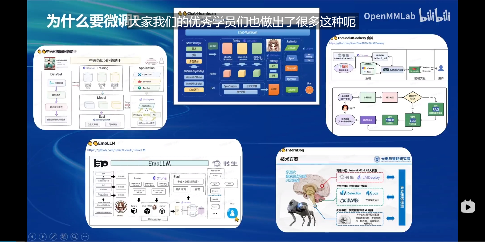
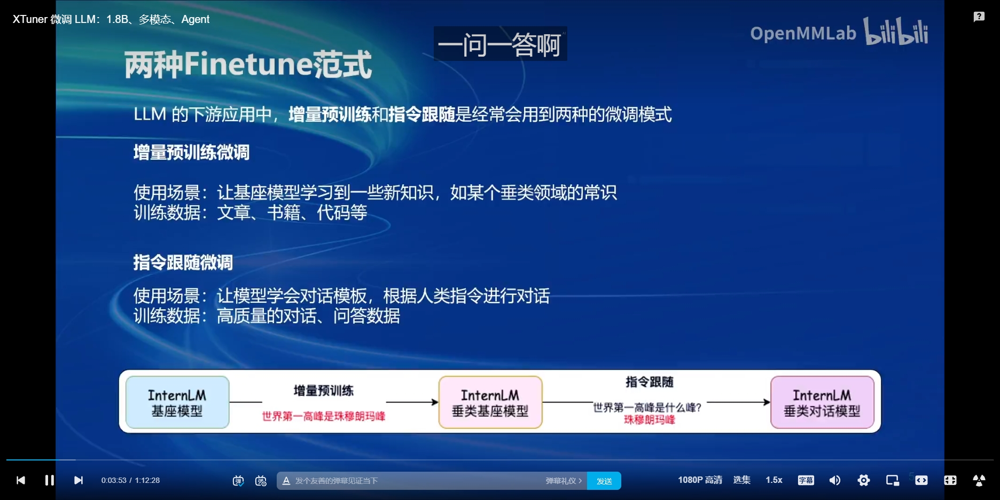

# 书生浦语大模型实战营二期 · 课程笔记_05

## 微调概述

​		微调（`Fine-tuning`）是一种迁移学习方法，它允许我们利用预训练的大模型（如`BERT、GPT`、`T5`、`InternLM`、`Electra`等）并针对特定任务进行调整。通过微调，我们可以将大模型适配到各种不同的自然语言处理任务中，如文本分类、命名实体识别、问答系统等。

## 为什么需要微调

​		

- **任务特定性**：预训练模型虽然强大，但通常不是针对特定任务训练的。微调可以帮助模型更好地适应特定任务的数据分布和特点。
- **性能提升**：通过微调，模型可以在特定任务上达到更高的准确率和效率。
- **灵活性**：微调允许我们根据不同的任务需求调整模型，使其更加灵活多变。

## 微调主要有两种范式

**增量预训练微调**

- 使用场景：该范式主要用于让基座模型学习到一些新知识，这些知识可能是某个特定垂类领域内的常识或专业知识。通过这种方式，模型能够在原有基础上进行扩展，增强其对特定领域的理解和处理能力。
- 训练数据：增量预训练微调通常需要大量的文章、书籍、代码等作为训练数据。这些数据能够提供丰富的领域知识和上下文信息，帮助模型更好地理解和吸收新知识。

**指令跟随微调**

- 使用场景：这种微调模式主要用于让模型学会对话模板，并能够根据人类的指令进行对话。通过这种方式，模型能够更好地理解人类的意图和需求，从而提供更为准确和有用的回应。

- 训练数据：指令跟随微调通常需要高质量的对话、问答数据作为训练素材。这些数据能够提供丰富的对话场景和指令类型，帮助模型学会如何根据不同的指令进行回应。

  

这两种微调范式在大型语言模型（LLM）的下游应用中经常被用到，各有其独特的使用场景和所需训练数据。它们对于**提高模型的性能、扩展模型的应用领域**以及**满足用户的个性化需求**都具有重要意义。

## **如何进行微调**

- **数据准备**：首先，需要准备用于微调的任务特定数据集。这些数据通常是标注好的，以便模型能够学习任务的特定模式和规则。
- **模型选择**：选择一个合适的预训练模型作为起点。这通常取决于任务的性质和数据的类型。
- **微调过程**：
  - **加载预训练模型**：首先加载选定的预训练模型。
  - **定义任务**：根据具体任务（如文本分类、实体识别等）修改模型的输出层，以适应新的任务。
  - **训练**：使用任务特定的数据集对模型进行训练。在这个过程中，模型的权重会根据任务数据进行调整。
  - **验证与优化**：使用验证集评估模型的性能，并根据需要进行超参数调整以优化模型。
- **评估与部署**：在测试集上评估模型的性能，并将其部署到生产环境中。

## Lora和QLoRA

​		`Lora`和`QLoRA`都是在大型模型（尤其是大型语言模型）微调中应用的技术。它们为模型调整提供了新的方法和思路，使得模型能够更高效地适应新任务或数据集。

### Lora（Low-Rank Adaptation）

Lora 是一种高效的微调技术，它通过在原始模型参数上增加一个低秩（low-rank）的更新来适应新任务。这意味着它不是在原始模型的全部参数上进行微调，而只是在一小部分参数上进行调整，从而大大降低了微调的计算复杂性和显存使用量。

- **效率提升**：通过减少需要更新的参数数量，Lora显著降低了微调的计算成本。
- **泛化性增强**：由于限制了模型的复杂度，Lora有助于防止在训练数据有限的情况下的过拟合现象。
- **无缝集成**：Lora可以轻松地集成到现有的神经网络架构中，以最小的额外训练成本对预训练模型进行微调。

### QLoRA

QLoRA 结合了量化计算和深度学习，利用量化梯度下降（QGD）来加速大型语言模型的优化过程。它通过量子计算的优势来改进传统的梯度下降方法，从而更有效地微调大型语言模型。

- **效率与性能提升**：通过引入量化计算，QLoRA 提高了模型训练的效率，并且增强了模型的性能，使其能够更好地理解和处理复杂的语言数据。
- **成本降低**：QLoRA 使得在消费级的GPU上微调大型语言模型成为可能，降低了微调的成本，使更多的研究人员和开发者能够使用和开发大型语言模型。

## 模型微调两种加速方式

|    技术名称     |            关键信息            |               原理简述               |              应用场景              |               使用效果               |
| :-------------: | :----------------------------: | :----------------------------------: | :--------------------------------: | :----------------------------------: |
| Flash Attention |    优化注意力机制的计算方法    |      降低显存读写，加快计算速度      | 适用于使用注意力机制的深度学习模型 |  显著提升训练速度，降低硬件资源消耗  |
| DeepSpeed ZeRO  | 大规模分布式深度学习的内存优化 | 分割并分配优化器状态、梯度和模型参数 |   适用于训练超大规模深度学习模型   | 降低内存占用，加速训练，降低硬件成本 |

​		

​		综上所述，Flash Attention和DeepSpeed ZeRO是两种有效的模型微调加速方式。它们分别通过优化注意力机制的计算和降低内存占用来提高训练效率，使得在有限的计算资源下更高效地微调大型模型成为可能。

