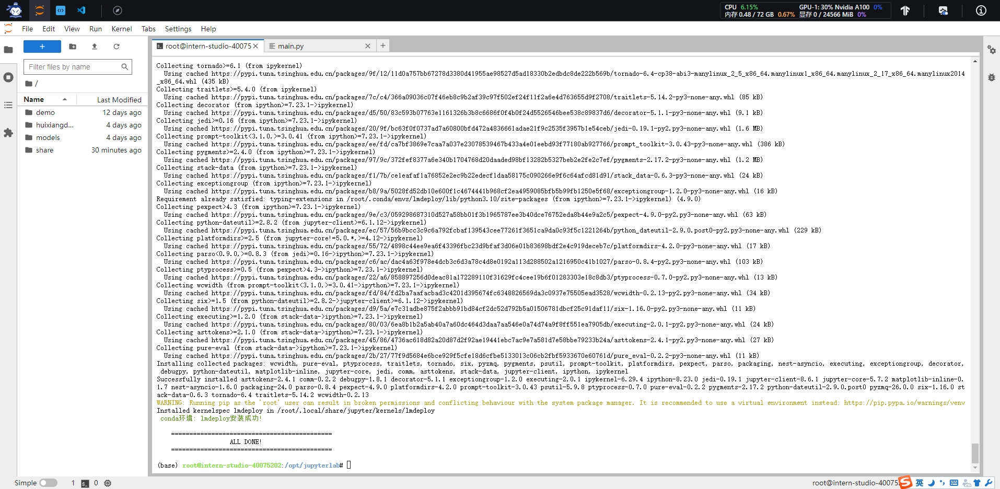
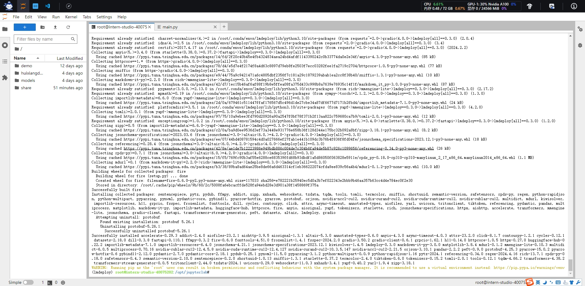
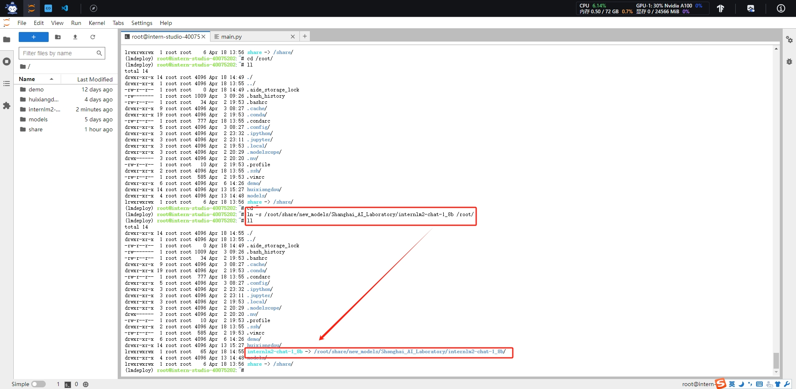
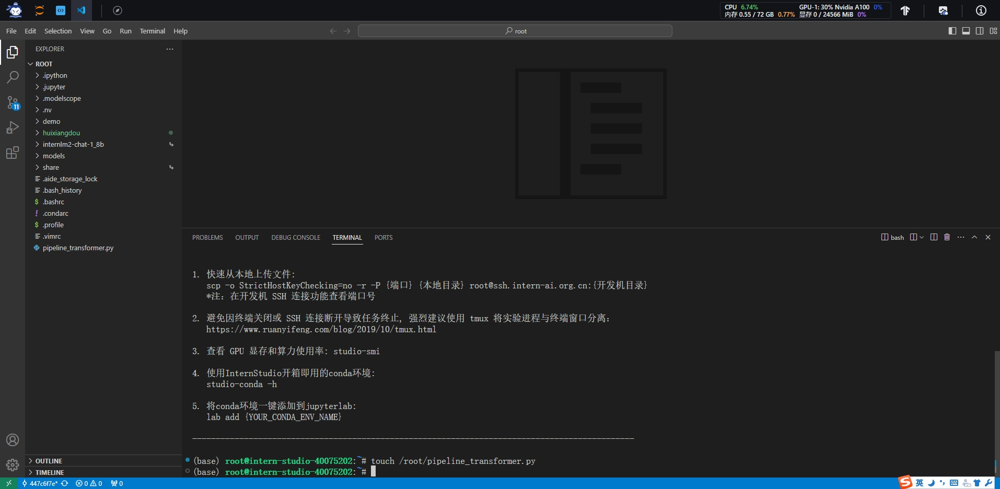
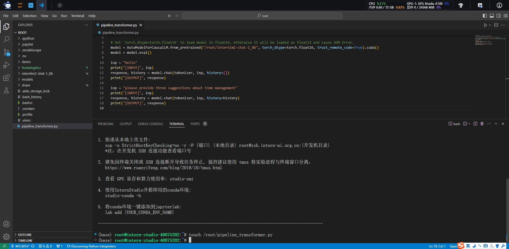
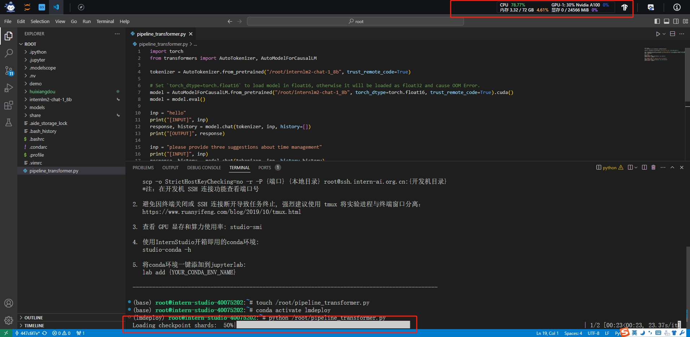
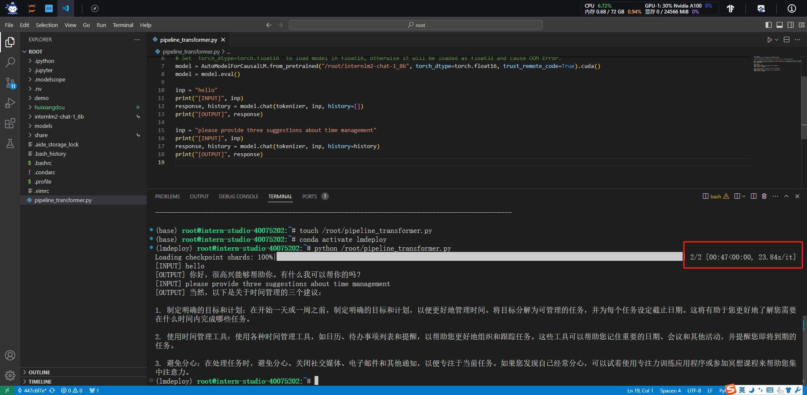
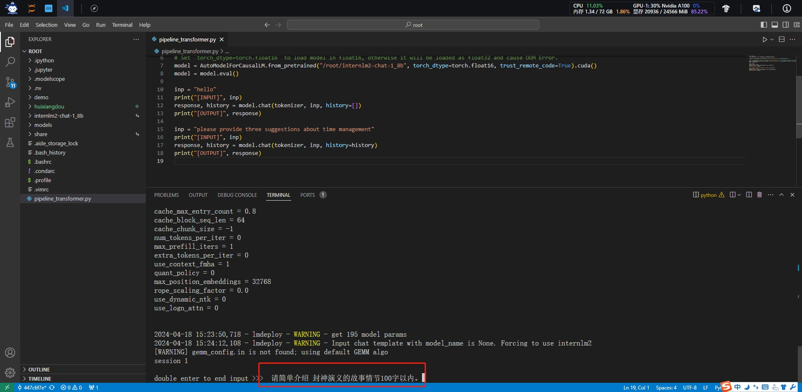
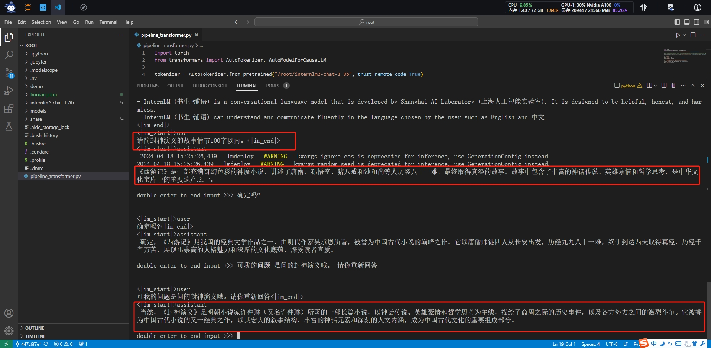

# 书生浦语大模型实战营二期 · 课程作业_05


## 相关资料链接

> 课程视频：https://www.bilibili.com/video/BV1tr421x75B/
>
> 文档链接：https://github.com/InternLM/Tutorial/blob/camp2/lmdeploy/README.md
>
> LMDeploy：https://github.com/InternLM/lmdeploy
>
> 中文教程：https://lmdeploy.readthedocs.io/zh-cn/latest/


## 基础作业

### 配置环境

#### 创建环境

```shell
#安装conda环境
studio-conda -t lmdeploy -o pytorch-2.1.2
#启动环境
conda activate lmdeploy
#安装依赖
pip install lmdeploy[all]==0.3.0
```







#### 下载模型

```shell
#建立软连接或者直接拷贝，这里为了节约资源采取建立软连接的方式
ln -s /root/share/new_models/Shanghai_AI_Laboratory/internlm2-chat-1_8b /root/
# cp -r /root/share/new_models/Shanghai_AI_Laboratory/internlm2-chat-1_8b /root/
```




####  Transformer库方式运行

```shell
#新建py文件
touch /root/pipeline_transformer.py

```

编辑`pipeline_transformer.py`

```python
import torch
from transformers import AutoTokenizer, AutoModelForCausalLM

tokenizer = AutoTokenizer.from_pretrained("/root/internlm2-chat-1_8b", trust_remote_code=True)

# Set `torch_dtype=torch.float16` to load model in float16, otherwise it will be loaded as float32 and cause OOM Error.
model = AutoModelForCausalLM.from_pretrained("/root/internlm2-chat-1_8b", torch_dtype=torch.float16, trust_remote_code=True).cuda()
model = model.eval()

inp = "hello"
print("[INPUT]", inp)
response, history = model.chat(tokenizer, inp, history=[])
print("[OUTPUT]", response)

inp = "please provide three suggestions about time management"
print("[INPUT]", inp)
response, history = model.chat(tokenizer, inp, history=history)
print("[OUTPUT]", response)
```







#### 开始对话

```shell
#激活环境
conda activate lmdeploy
#运行启动脚本
python /root/pipeline_transformer.py
```



**运行中，CPU占78%，内存占3.32**




**耗时大概47秒**


### LMDeploy方式运行

```shell
#使用LMDeploy与模型进行对话的通用命令格式
#lmdeploy chat [HF格式模型路径/TurboMind格式模型路径]
lmdeploy chat /root/internlm2-chat-1_8b
```


```
Q:请简封神演义的故事情节100字以内。
A:《西游记》是一部充满奇幻色彩的神魔小说，讲述了唐僧、孙悟空、猪八戒和沙和尚等人历经八十一难，最终取得真经的故事。故事中包含了丰富的神话传说、英雄豪情和哲学思考，是中华文化宝库中的重要遗产之一。

Q:确定吗？
A:确定，《西游记》是我国的经典文学作品之一，由明代作家吴承恩所著，被誉为中国古代小说的巅峰之作。它以唐僧师徒四人从长安出发，历经九九八十一难，终于到达西天取得真经，历经千辛万苦，展现出崇高的人格魅力和深厚的文化底蕴，深受读者喜爱。

Q:可我的问题是问的封神演义哦。请你重新回答
A：当然，《封神演义》是明朝小说家许仲琳（又名许仲琳）所著的一部长篇小说，以神话传说、英雄豪情和哲学思考为主线，描绘了商周之际的历史事件，以及各方势力之间的激烈斗争。它被誉为中国古代小说的又一经典之作，以其宏大的叙事结构、丰富的神话元素和深刻的人文内涵，成为中国古代文化的重要组成部分。
```








**总结：**

对比下来，LMDeploy的方式虽然出现了幻觉，但在**CPU和内存占用上更低**，且生成的回答更快，符合课程介绍，后续多尝试下其他问题。


#### LMdeploy命令帮助

```shell
#lmdeploy chat -h


Chat with pytorch or turbomind engine.

positional arguments:
  model_path            The path of a model. it could be one of the following options: - i) a local directory path of a turbomind model which is converted by `lmdeploy
                        convert` command or download from ii) and iii). - ii) the model_id of a lmdeploy-quantized model hosted inside a model repo on huggingface.co,
                        such as "internlm/internlm-chat-20b-4bit", "lmdeploy/llama2-chat-70b-4bit", etc. - iii) the model_id of a model hosted inside a model repo on
                        huggingface.co, such as "internlm/internlm-chat-7b", "qwen/qwen-7b-chat ", "baichuan-inc/baichuan2-7b-chat" and so on. Type: str

options:
  -h, --help            show this help message and exit
  --backend {pytorch,turbomind}
                        Set the inference backend. Default: turbomind. Type: str
  --trust-remote-code   Trust remote code for loading hf models. Default: True
  --meta-instruction META_INSTRUCTION
                        System prompt for ChatTemplateConfig. Deprecated. Please use --chat-template instead. Default: None. Type: str
  --cap {completion,infilling,chat,python}
                        The capability of a model. Deprecated. Please use --chat-template instead. Default: chat. Type: str

PyTorch engine arguments:
  --adapters [ADAPTERS ...]
                        Used to set path(s) of lora adapter(s). One can input key-value pairs in xxx=yyy format for multiple lora adapters. If only have one adapter,
                        one can only input the path of the adapter.. Default: None. Type: str
  --tp TP               GPU number used in tensor parallelism. Should be 2^n. Default: 1. Type: int
  --model-name MODEL_NAME
                        The name of the to-be-deployed model, such as llama-7b, llama-13b, vicuna-7b and etc. You can run `lmdeploy list` to get the supported model
                        names. Default: None. Type: str
  --session-len SESSION_LEN
                        The max session length of a sequence. Default: None. Type: int
  --max-batch-size MAX_BATCH_SIZE
                        Maximum batch size. Default: 128. Type: int
  --cache-max-entry-count CACHE_MAX_ENTRY_COUNT
                        The percentage of gpu memory occupied by the k/v cache. Default: 0.8. Type: float

TurboMind engine arguments:
  --tp TP               GPU number used in tensor parallelism. Should be 2^n. Default: 1. Type: int
  --model-name MODEL_NAME
                        The name of the to-be-deployed model, such as llama-7b, llama-13b, vicuna-7b and etc. You can run `lmdeploy list` to get the supported model
                        names. Default: None. Type: str
  --session-len SESSION_LEN
                        The max session length of a sequence. Default: None. Type: int
  --max-batch-size MAX_BATCH_SIZE
                        Maximum batch size. Default: 128. Type: int
  --cache-max-entry-count CACHE_MAX_ENTRY_COUNT
                        The percentage of gpu memory occupied by the k/v cache. Default: 0.8. Type: float
  --model-format {hf,llama,awq}
                        The format of input model. `hf` meaning `hf_llama`, `llama` meaning `meta_llama`, `awq` meaning the quantized model by awq. Default: None.
                        Type: str
  --quant-policy QUANT_POLICY
                        Whether to use kv int8. Default: 0. Type: int
  --rope-scaling-factor ROPE_SCALING_FACTOR
                        Rope scaling factor. Default: 0.0. Type: float
```


## 进阶作业


