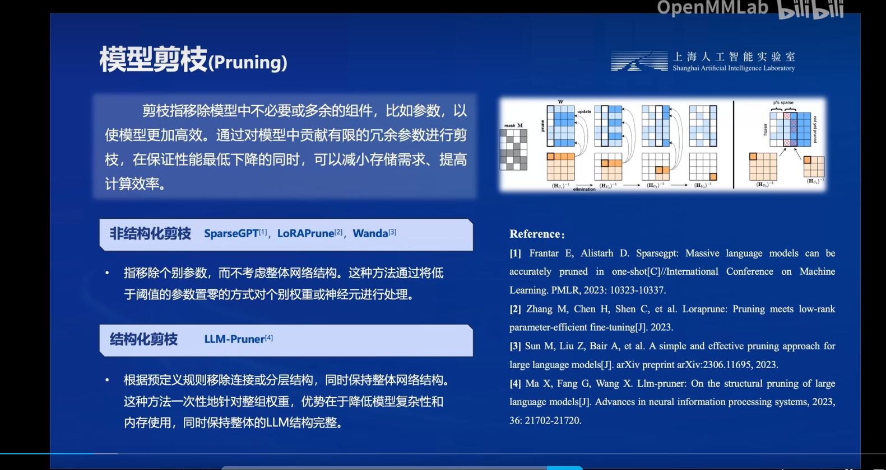

# 书生浦语大模型实战营二期 · 课程笔记_05


## LMDeploy简介


​		

​		`LMDeploy`（语言模型部署工具）是由`HashTang`公司研发的一款用于部署自然语言处理模型的全流程解决方案。通过`LMDeploy`用户可以方便快捷地将训练好的语言模型**部署到各种平台**上，比如移动应用、网站、智能设备等。该工具提供了简单易用的界面和丰富的功能，帮助用户轻松实现模型部署和管理，提升**部署效率和模型性能**。

- 模型轻量化、推理和服务。

- 量化：降低显存占用，提升推理速度


- 推理引擎TurboMind：持续批处理，
- 有状态的推理：高性能cuda kernel，Blocked k/v cache

- 推理服务: api server


**交互式推理：不再为对话历史买单**		

​		在多轮对话场景中，很多推理引擎要求用户在每一轮对话中，将先前的对话历史和轮对话的提示一起发送到服务器。这就意味着，每一轮对话用户都必须为过去的对话历史买单。然而，`LMDeploy` 则能够**缓存对话**的 `attention k/v`，这样就可以避免重复处理历史对话，这种方式被称为交互式推理。当历史记录较长时，这种方法可以显著降低生成第一个 `token` 所需的时间。


**Persistent batch：batch 永动机**

在多用户服务场景中，对话的请求和响应长度不等。如何在这种场景下，对请求批处理，提高系统吞吐量，是推理面临的难题之一。`LMDeploy` 提出的 `persistent batch` 方案，完美解决这一难题。

简单来说，它的工作原理是：

- 维护具有 N 个可配置的批处理槽（`batch slot`）
- 当有空闲槽位时，请求会加入批处理。一旦请求的 `token` 生成完成，该槽位会被释放，供下个请求使用
- 批处理会自动增长或者缩小，以最小化不必要的计算


**部分参考命令：**

```shell
#高效推理
lmdeploy chat -h

#量化压缩
lmdeploy lite -h

#服务化部署
lmdeploy serve -h
```


## 部署挑战

| 挑战           | 面临的方面                             | 描述                                                         |
| -------------- | -------------------------------------- | ------------------------------------------------------------ |
| 资源需求       | 访存瓶颈、内存开销                     | 大模型需要更多的计算资源和存储空间来进行部署。               |
| 性能优化       | 推理速度、响应时间、动态请求           | 需要对大模型进行优化，以确保在部署过程中获得高性能。         |
| 部署复杂性     | 模型集成、版本管理、依赖项处理         | 大模型的部署可能涉及多个环节和技术，需要综合考虑系统架构和数据流程。 |
| 实时性要求     | 实时处理大模型的推理需求               | 一些场景对模型的实时性要求很高，需要在部署中考虑延迟和响应速度。 |
| 安全与隐私风险 | 数据加密、访问控制、安全认证           | 大模型部署可能涉及敏感信息，需要采取安全措施保护模型和数据的隐私。 |
| 维护和监控     | 定期性能监控、异常检测、问题排查与修复 | 一旦部署完成，需要对大模型进行定期维护和监控，确保其性能和稳定性。 |


## 模型剪枝




​		模型剪枝就像修剪一颗树，通过去除神经网络中**冗余的参数**和**连接**，使模型更加精简轻巧，简单点说是为了**加快推理速度、降低内存消耗**；而实际上需要在保持模型性能的前提下精心**设计剪枝策略**，确保削减模型大小的同时不损害其表现能力。


**常见剪枝策略：**

| 剪枝策略   | 描述                     | 优势                                                         | 劣势                                                         |
| ---------- | ------------------------ | ------------------------------------------------------------ | ------------------------------------------------------------ |
| 权重剪枝   | 基于权重大小进行剪枝     | 可以减少模型参数量，提高推理速度；实现简单，容易理解和实现   | 可能会导致较大的精度损失，需要精细调整剪枝比例；对大型模型来说计算开销较大 |
| 通道剪枝   | 以通道为单位进行剪枝     | 可以减少计算量，加速推理过程；有效减小模型大小，减少内存消耗 | 对于不规则结构的模型剪枝效果不佳；可能导致某些通道被整个裁减掉，影响特征的完整性 |
| 结构化剪枝 | 对整个网络结构进行剪枝   | 保持模型结构有机稳定，不会伤害模型特征交互性；减小模型尺寸，提升计算效率 | 实现技术复杂，难以应用于所有类型的模型；可能需要特定的剪枝算法和工具支持 |
| 阈值剪枝   | 根据权重阈值进行剪枝     | 简单易实现，性能较好；可以减少存储和推理开销；加速模型预测速度 | 需要手动设置阈值，选择不当可能导致信息丢失；可能无法达到最优剪枝效果 |
| 一次性剪枝 | 一次性裁剪部分参数或连接 | 可以一次性减少模型参数量，节约计算资源；简单快速，一次性完成 | 可能会造成较大的性能损失，难以保证模型的稳定性；不适用于要求高精度和鲁性的任务 |
| 迭代剪枝   | 多次迭代训练和剪枝       | 可以逐步减小模型规模，保持模型性能；提高模型的稀疏性，减少计算复杂度 | 训练和剪枝过程较为复杂，耗时较长；可能需要额外的存储空间和计算资源 |
| 结合剪枝   | 结合多种不同剪枝策略     | 可以综合考虑不同剪枝策略的优势，获得更好的剪枝效果；适用于各种模型和任务 | 需要根据具体情况调整和优化组合方式；增加了实现和调试的难度，可能需要更多的人力物力资源支持 |

​		

## 模型量化


​		首先，需要明白大模型中的量化（`Quantization`）是指将模型中的数值表示从浮点数转换为定点数或较低位的浮点数，以减少模型的存储空间和计算复杂度。通过量化，可以将模型中的参数、激活值等从32位浮点表示缩减为8位整数或更低的位数，从而在**不显著影响模型性能**的情况下**减小模型的体积**、**加速推理过程**，并**降低硬件需求和功耗**。


**建议初学者以下步骤进行：**

- 了解量化的原理：理解量化是如何通过减少数字表示的位数来压缩模型，以及如何在保持模型准确性的前提下提高推理速度。

- 学习量化的方法：掌握常见的量化方法，如对称量化、非对称量化、最小化量化误差等，以及如何选择合适的量化方案。

- 熟悉量化工具和框架：学习使用各种深度学习框架提供的量化工具，如TensorFlow Lite、PyTorch，LMDeploy等，以及了解硬件平台对于量化的支持情况。

- 实践和调试：尝试在实际项目中应用量化技术，对模型进行量化训练、量化推理，并通过调试工具和指标评估量化对模型性能的影响，逐步优化量化方案。

- 关注最新研究和技术：跟踪相关领域的最新进展和研究成果，了解新的量化方法和工具，不断更新自己的知识和技能。