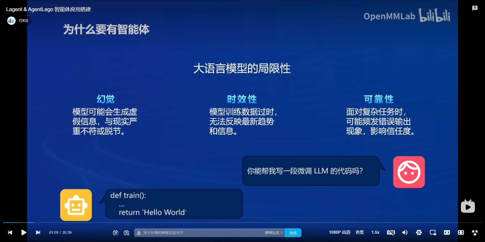
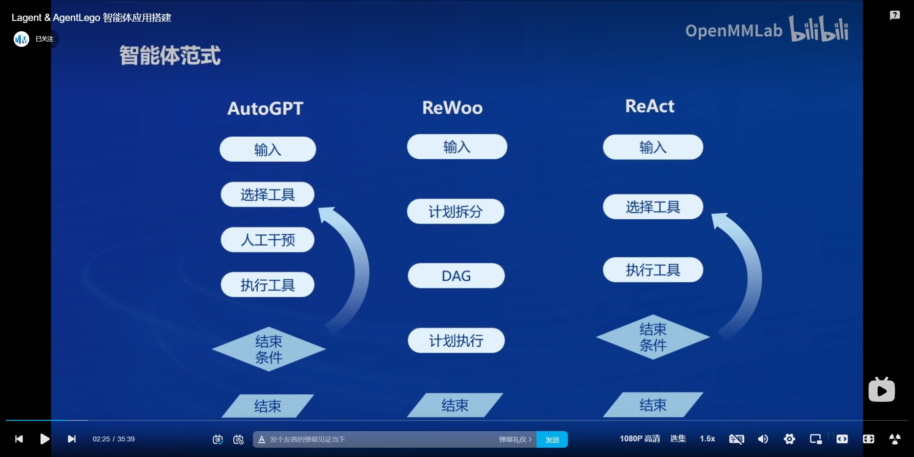

# 书生浦语大模型实战营二期 · 课程笔记_06

## 智能体定义

- 智能体是一个能够感知环境、接收指令、执行任务并返回结果的实体。
- 在大模型时代，智能体通常与大型语言模型（LLM）结合，以更智能的方式执行任务。

### 有不同类型的智能体

- 执行代理（Execution Agent）：能够执行实际操作的智能体，如自动化脚本、机器人等。
- 计划基础智能体（ReWoo）：基于规划和决策的智能体，能够制定并执行复杂的任务计划。

**智能体又可以根据不同的分类标准被分为以下类型**：

|          分类标准          |     智能体类型     |                             描述                             |
| :------------------------: | :----------------: | :----------------------------------------------------------: |
|   **体系结构和主要特性**   |    认知型智能体    | 具有完整的符号模型，描述和感知外部环境，能与其他智能体协作，具备记忆、存储和分析功能 |
|                            |    反应型智能体    |        基于刺激-反应规则，感知外部环境并作出相应反应         |
|                            |    混合型智能体    |             兼具认知型智能体和反应型智能体的特性             |
|     **应用领域和功能**     |  服务型智能机器人  |              如家用服务机器人、医疗护理机器人等              |
|                            |  工业型智能机器人  |                用于生产线上的自动化和精确操作                |
|                            |  教育型智能机器人  |                   辅助教育和学习的智能系统                   |
|                            |  娱乐型智能机器人  |                  提供娱乐和休闲功能的机器人                  |
|                            |  军事型智能机器人  |                   用于军事侦察、作战等任务                   |
| **服务目标客群和产品能力** | 非平台级智能体产品 |               服务场景单一，缺乏特定行业知识库               |
|                            | AI Agent平台化价值 |           提供构建、应用、分享、反馈的平台级智能体           |
|                            | 企业级AI智能体平台 |       具备自主拆解任务、感知当前环境、执行并反馈等能力       |
|                            |    超自动化平台    | 具有成熟的超自动化底层技术融合能力和丰富的业务场景自动化部署经验 |
|     **系统角色和功能**     |     管理智能体     |      负责智能体系统的管理和调度，如注册、生命周期管理等      |
|                            |     功能智能体     |        负责实现特定的功能，如数据存储、时空数据处理等        |
|                            |     传感智能体     |      负责采集原始数据，并将数据传输至功能智能体进行处理      |
|                            |     执行智能体     |            根据指令或决策结果执行相应的操作或任务            |

## 为什么需要智能体

​		

​		首先我们要明白，智能体则是一种能够自主感知、分析、决策并执行任务的软件实体，它具备驻留性、反应性、社会性和主动性等特征。智能体可以根据环境变化自主决策并执行相应操作，从而实现对数据的智能处理和分析。所以在大模型应用中智能体可以发挥以下作用：

- **自动化数据处理**：智能体可以自动从各种数据源中收集数据，并进行预处理、清洗、标注等操作，为大模型的训练和应用提供高质量的数据支持。
- **智能化决策支持**：智能体可以根据大模型的输出结果和实时数据，进行智能化分析和决策，为用户提供更精准的预测、推荐、优化等服务。
- **高效化任务执行**：智能体可以自动化执行大模型中的某些任务，如自动标注、自动优化等，从而提高任务执行的效率和质量。

此外，智能体还可以与大模型进行深度融合，形成更加智能的系统。例如，智能体可以利用大模型的视觉处理能力，实现对图像、视频等多媒体数据的智能分析和处理；同时，大模型也可以利用智能体的感知和决策能力，实现对更复杂场景和任务的智能处理，达到相辅相成的效果。

## 智能体的运作方式

- **感知与数据获取**：智能体首先通过感知模块获取环境中的信息和数据。这可能涉及到使用传感器获取感知数据，如图像、声音、位置或其他传感器所提供的输入。这些感知数据是智能体了解环境状态的基础。

- **状态理解与推理**：在获得感知数据后，智能体会进行状态理解和推理，从而理解环境的当前状态。通过应用先前学习的知识或使用特定的推理算法，智能体可以对感知数据进行解释和分析，并生成对环境状态的认知。这个过程中，智能体可能会运用各种人工智能技术和算法，如模式识别、机器学习等。

- **决策制定**：基于对环境状态的理解，智能体会进行决策制定。它可以评估不同的选项和策略，并选择最佳的行动方案。这个决策过程可能涉及到利用优化算法、规则系统或强化学习等技术。智能体的决策制定能力是其智能水平的重要体现，也是其能否有效完成任务的关键。

- **行动执行与反馈**：一旦决策制定完成，智能体将执行相应的行动。通过行动模块，智能体可以与环境进行交互，并改变环境状态。在执行行动后，智能体会继续感知环境中的反馈信息，包括奖励、惩罚或其他形式的反馈，以评估行动的效果。这些反馈信息对于智能体的学习和优化至关重要。

### 智能体运作特点

| 运作特点 |                             描述                             |
| :------: | :----------------------------------------------------------: |
|  自主性  | 智能体能够根据自身目标和环境状态，自主地制定计划并执行行动，无需人类直接干预。 |
|  交互性  | 智能体能够与其他智能体或人类进行交互，通过通信和协作完成任务。 |
|  反应性  | 智能体能够实时感知环境的变化，并快速做出反应，以适应不同的环境。 |
|  主动性  |   智能体能够主动寻找并发现目标，而不仅仅是对环境做出反应。   |

## 智能体的构建与技能连接

- **通信**：智能体之间需要通过通信模块进行**信息交换**，通过通信模块发送自己的状态信息、目标信息、请求信息等，同时接收其他智能体的信息。

- **协作**：在接收到其他智能体的信息后，智能体需要根据这些信息来制定自己的行动方案。在协作过程中，智能体需要**考虑到其他智能体的状态和目标**，以实现共同完成任务的目标。

- **协调**：多个智能体在协作过程中可能会**出现冲突或不一致**的情况。为了解决这个问题，智能体之间需要**进行协调**。协调可以通过预设的规则、优化算法或者学习到的策略来实现。在协调过程中，智能体需要**权衡各种因素**，如目标、资源、时间等，以**达成一致的行动方案**。

## 智能体发展与挑战

#### 技术层面：

- **高质量数据集紧缺**：在训练复杂的智能体模型时，高质量、大规模的数据集是不可或缺的。然而，现实中获取这样的数据集往往面临诸多困难，如数据标注成本高、隐私保护问题等。

- **智能芯片依赖进口**：当前，许多智能体依赖进口的高性能芯片来运行复杂的计算任务。这不仅增加了成本，还可能面临供应链中断的风险。

- **缺乏“因明”和“内明”**：智能体在理解和推理方面还存在局限，无法像人类一样理解和演绎因果关系，也缺乏主观能动性。

  

#### **商业化落地：**

- 智能体技术在商业化落地过程中面临诸多挑战，如**技术成熟度不足、市场需求不明确、成本高昂**等。

  

#### **人才短缺：**

- 随着大模型技术的快速发展，对相关人才的需求也在不断增加。然而，目前智能体领域的人才储备相对不足，技术能力专精度不高，短期难以满足市场需求。

#### **伦理和道德层面**：

- 随着智能体的广泛应用，如何确保其决策和行为符合伦理和道德标准成为一个重要问题。例如，在自动驾驶领域，智能体需要在紧急情况下做出决策，这可能涉及到人类生命的牺牲。

