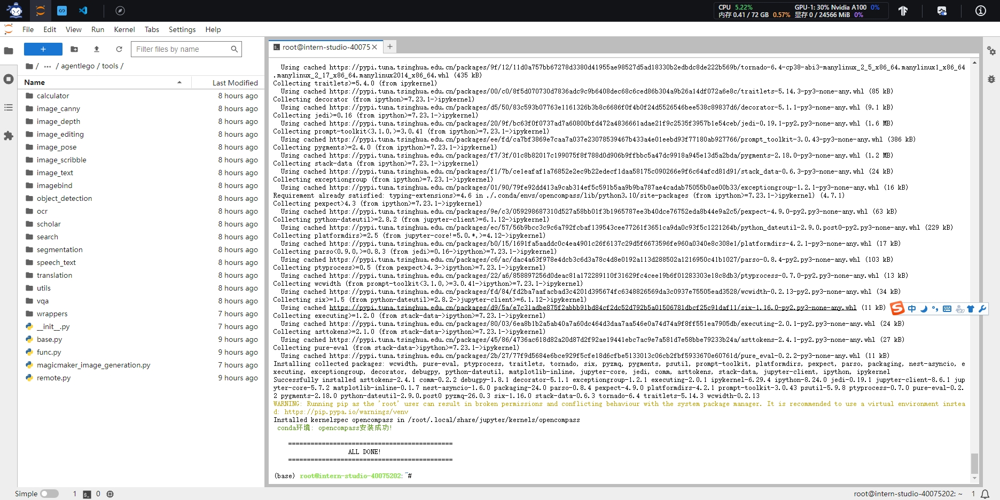
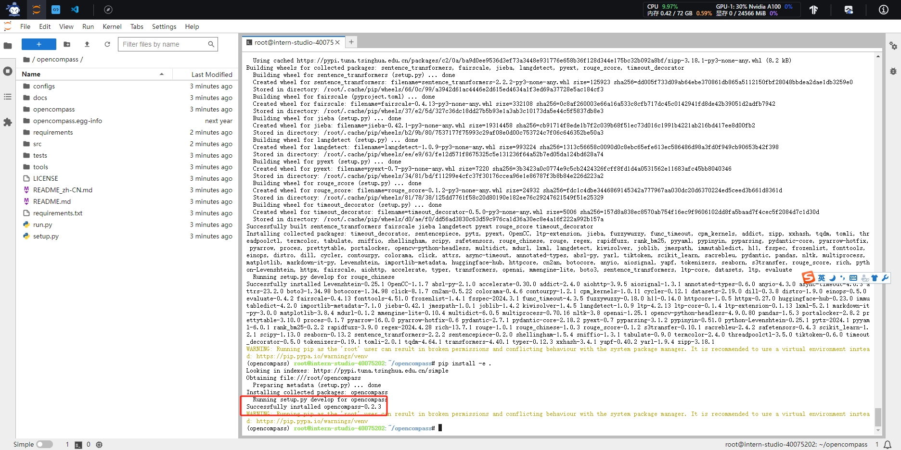
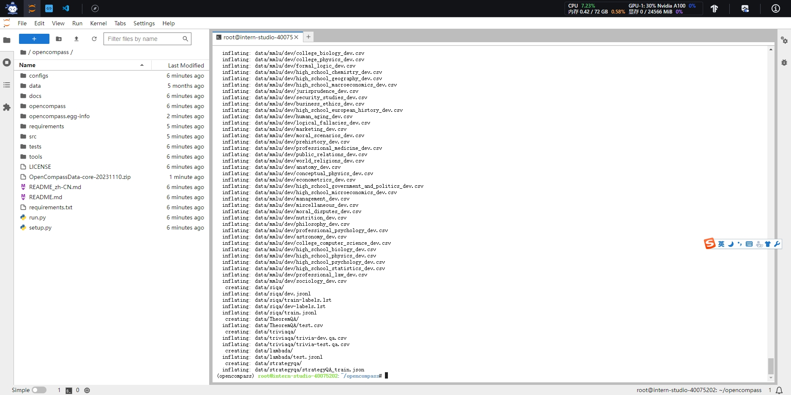
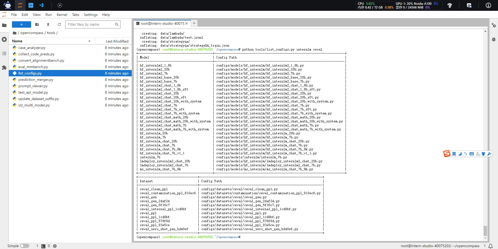
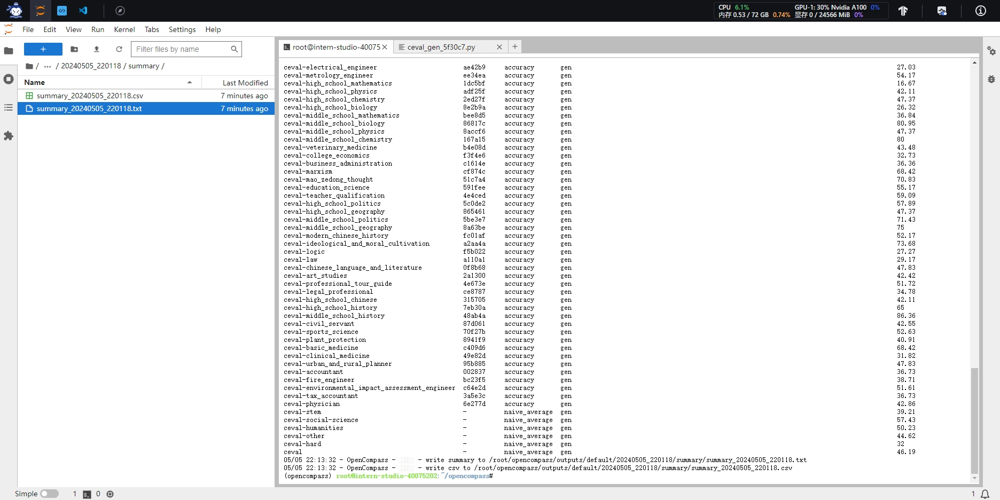

# 书生浦语大模型实战营二期 · 课程作业_06


## 相关资料链接

> 课程视频：https://www.bilibili.com/video/BV1Pm41127jU/
>
> 文档链接：https://github.com/InternLM/Tutorial/blob/camp2/opencompass/readme.md
>


## 基础作业

### 配置环境

```shell
#安装conda环境
studio-conda -o internlm-base -t opencompass
#启动环境
source activate opencompass
#拉去源码
git clone -b 0.2.4 https://github.com/open-compass/opencompass
# 进入目录
cd opencompass
#安装依赖
pip install -r requirements.txt
#安装 opencompass
pip install -e .
#解压数据集
cp /share/temp/datasets/OpenCompassData-core-20231110.zip /root/opencompass/
unzip OpenCompassData-core-20231110.zip
#查看 InternLM 及 C-Eval 相关的配置
python tools/list_configs.py internlm ceval
#解决bug
pip install protobuf
export MKL_SERVICE_FORCE_INTEL=1
#执行命令
python run.py --datasets ceval_gen --hf-path /share/new_models/Shanghai_AI_Laboratory/internlm2-chat-1_8b --tokenizer-path /share/new_models/Shanghai_AI_Laboratory/internlm2-chat-1_8b --tokenizer-kwargs padding_side='left' truncation='left' trust_remote_code=True --model-kwargs trust_remote_code=True device_map='auto' --max-seq-len 1024 --max-out-len 16 --batch-size 2 --num-gpus 1 --debug
```


安装环境成功







获取数据集




查看配置




执行评测

```shell
python run.py
--datasets ceval_gen \
--hf-path /share/new_models/Shanghai_AI_Laboratory/internlm2-chat-1_8b \  # HuggingFace 模型路径
--tokenizer-path /share/new_models/Shanghai_AI_Laboratory/internlm2-chat-1_8b \  # HuggingFace tokenizer 路径（如果与模型路径相同，可以省略）
--tokenizer-kwargs padding_side='left' truncation='left' trust_remote_code=True \  # 构建 tokenizer 的参数
--model-kwargs device_map='auto' trust_remote_code=True \  # 构建模型的参数
--max-seq-len 1024 \  # 模型可以接受的最大序列长度
--max-out-len 16 \  # 生成的最大 token 数
--batch-size 2  \  # 批量大小
--num-gpus 1  # 运行模型所需的 GPU 数量
--debug
```


评测结果




